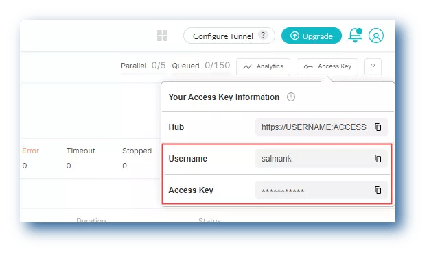
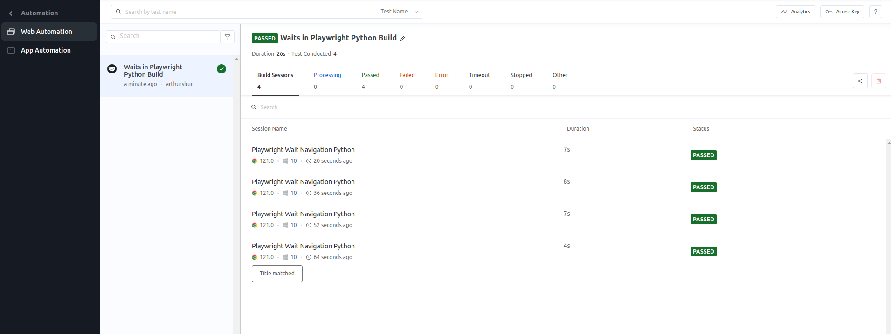

## Waits in Playwright Testing with Python

This repo contains code to show how waits in Playwright can be implemented on LambdaTest cloud

on a chrome browser.

### Setup


1. Fork this repo
   * `cd waits-in-playwright`
2. Install the following dependencies:
   * Install node package managet `npm install`
   * Install PlayWright `pip3 install playwright==1.39.0`
3. In order to run your Playwright tests, you will need to set your LambdaTest username and access key in the environment variables. Click the **Access Key** button at the top-right of the Automation Dashboard to access it.

    
4. Set your **Username** and **Access Key** as follows:
   * **Linux:**

     ```bash
     export LT_USERNAME="YOUR_LAMBDATEST_USERNAME"
     export LT_ACCESS_KEY="YOUR_LAMBDATEST_ACCESS_KEY"
     ```
   * **Windows:**

   ```bash
   set LT_USERNAME="YOUR_LAMBDATEST_USERNAME"
   set LT_ACCESS_KEY="YOUR_LAMBDATEST_ACCESS_KEY"
   ```

### How to Run the Test

To run the *waits in Playwright* on Chrome on LambdaTest cloud platform:

Run the command - `python3 wait_navigation.py`

* Go to your LambdaTest dashboard
* Click **Automation** on the left side bar
* Click  **Web Automation**
* Select **Configure Test Suite**
* Select **Playwright** as testing framework
* Select **Python** as programming language
* Click **View Results**

You should see results of your test performed as seen in the screenshot below:

```markup

```

 


